# Hi, I'm LounNight 👋

💻 **Full Stack & Desktop App Developer** | 🐧 **Linux User** | 🛠️ **Open Source Contributor**

I build **desktop applications, web applications, developer tools, and open-source projects**.

Currently working on **LibreGlow** and exploring networking and Linux development.

---

## 🚀 What I'm Doing

* 🔭 Building **[LibreGlow](https://github.com/libreglow)** projects
* 🖥️ Developing Linux **desktop applications**
* 🌐 Building full-stack web applications
* 🐧 Exploring Linux and system-level development
* 🌱 Currently learning **Networking**

---

## ⭐ Projects
### LibreGlow:
[GlowSnap](https://github.com/LibreGlow/GlowSnap): A fast and modern **Linux screenshot and screen recording application** built for productivity.

### Raheq project:
[Raheq Data](https://github.com/Nothamod6R/raheq-data): Backend services and data infrastructure for **Raheq**, providing APIs and data processing for the application.

[Raheq Extension](https://github.com/lounnight/raheq-extension): A extension in the browsers for **Raheq**, it used to remind people of the prayer.

[Raheq alislam website](https://github.com/lounnight/raheq-islam-website): A islamic website for **Raheq**, it used to Read Quran, hadith, prayer, etc.

---

## 🛠️ Tech Stack

### Languages

### Frontend

### Backend & Databases

### Desktop & Tools

---

## 📊 GitHub Status

  

  

  

---

## 📈 GitHub Activity

  

---

## 🧠 Currently Learning

**Networking**

---

## 📫 Connect With Me

---

  

  <i>Thanks for visiting my profile! 🚀</i>

